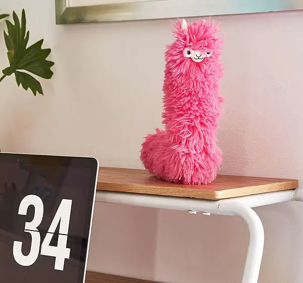
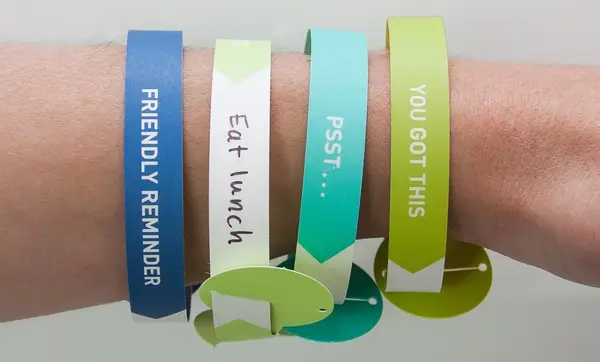
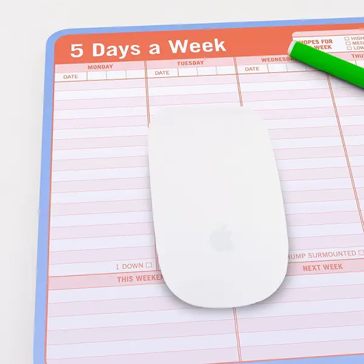
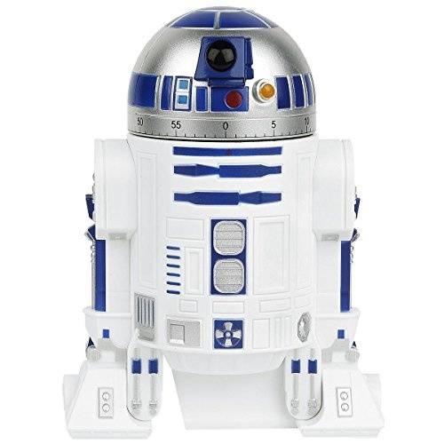
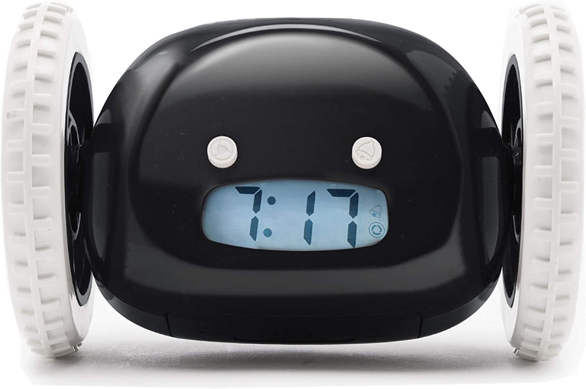
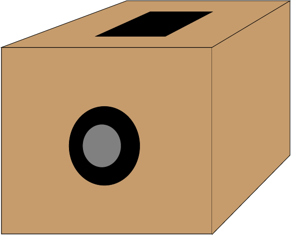
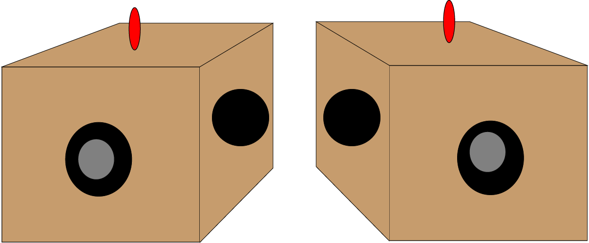
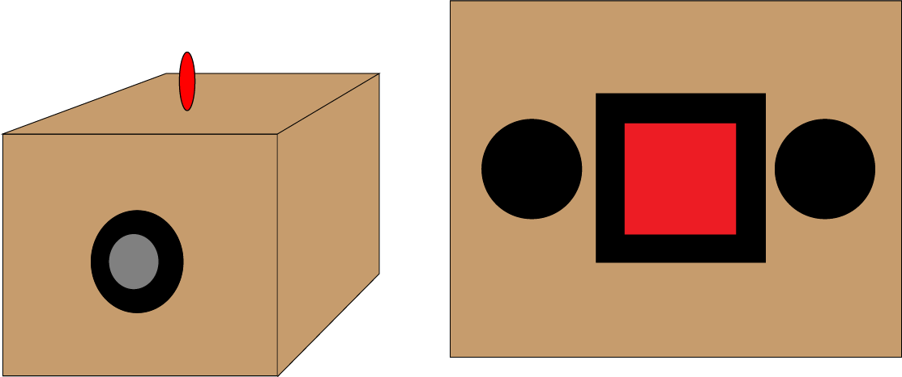
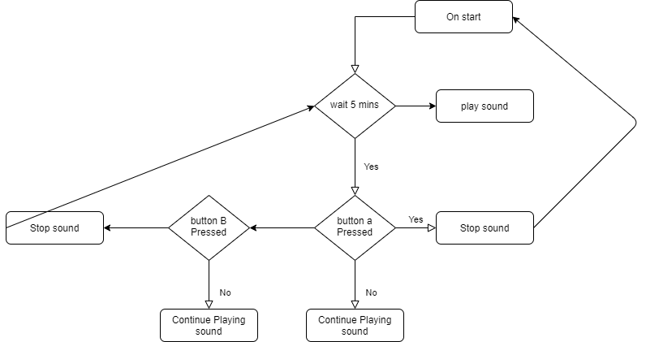

# 1701QCA Making Interaction - Assessment 2 workbook

You will use this workbook to keep track of your progress through the course and also as a process journal to document the making of your projects. The comments in italics throughout the template give suggestions about what to include. Feel free to delete those instructions when you have completed the sections.

When you have completed the template, submit the link to the GitHub Pages site for this repository as a link in Learning@Griffith. The link should be something like [https://qcainteractivemedia.github.io/1701QCA-Assessment2/](https://qcainteractivemedia.github.io/1701QCA-Assessment2/) where `qcainteractivemedia` is replaced with your GitHub username and `1701QCA-Assessment2` is replaced with whatever you called the repository this template is contained in when you set it up.

## Project working title ##

Anti Procrastination Helper

## Related projects ##

### Related project 1 ###
Llama Duster

https://www.youtube.com/watch?v=iK9rjrIVs7I

 A llama duster who'll say "no prob-llama" when you wait until every inch of your home is covered in dust. This Projetc is related to mine due to it keeps reminiding the user to complete their task.

https://knockknockstuff.com/products/friendly-reminder-wrist-notes

 A set of reminder bracelets if you need a *trick up your sleeve* to actually get around to calling mom. This is related to mine as instead of making soounds the braclets help keep you focused on top of ur work.

https://knockknockstuff.com/products/5-days-a-week-paper-mousepad

A manageable mousepad to make your lingering list virtually unavoidable. This is similar to my project due to it is positiong on a table or desk/ near where productive work is to be done. The object helps keep ontop of work with a calendar as a mouse pad. this works like mine but instead of a long term my idea is short and in the moment.

https://geek.wish.com/product/star-wars-kitchen-timer---r2-d2-countdown-timer-with-rotating-head-59ffce912b0a1c0bd79c3ae6?hide_login_modal=true&share=web

A heroic timer who'll help you get that *beeping* work done in a set amount of time. This is very similar to my project as it makes a beep when the timer ends. The difference is between the two project is by on the r2d2 timer you have to reset the head similar to a timer found in the kitchen.

https://clocky.com/products/clocky?variant=13822296588390

Sleeping in is nice, but so is keeping your job. This means that no matter how much you don’t feel like it, you need to get out of bed on time. If you’re a chronic snooze button pusher, the Runaway Alarm Clock will definitely revolutionize your mornings. It ensures you’re up and out of bed the first time because you have to chase the thing to turn it off. This product is very similar to mine, but instead of the object staying still the robot runs away from the user.

## Other research ##
My other Research was into how many people procrastinate i.e have ADHD and I found that The estimated number of children ever diagnosed with ADHD, according to a national 2016 parent survey,1 is 6.1 million (9.4%). This number includes:
388,000 children aged 2–5 years
4 million children aged 6–11 years
3 million children aged 12–17 years
Boys are more likely to be diagnosed with ADHD than girls (12.9% compared to 5.6%). I used this info to come to a conclusion for my idea and final project. This was done by I found that with the invention of fidget spinners and toys of that kind most people with ADHD like to press buttons and touch stuff so I would like to make a box or tool that helps solve ADHD and a way that is still cool and fun.

### *Brief resource name/description* ###

https://www.cdc.gov/ncbddd/adhd/data.html

## Conceptual progress ##

### Design intent ###
My design intent is to make a device that helps with procrastination. This idea is to be used for both people with hearing disabilities,ADHD and people without. The design I hope to make is a system that the user puts on their desk and will have a countdown timer that then will alert the user to hopefully keep them on track and focused. The user does this by pressing a button that will reset a timer and continue untill they finish their project or task.
### Design concept 1 ###

For my First Idea I have designed a box that has a buzzer on the front that will help the user stay focused and stay on task to complete their task. The top of the box has the micro bit on the box. this was to use as a light to also indicate that the timer as gone off and to reset the box to get back to work. The micro bit will display a light or message (yet to be decied).

### Design concept 2 ###

For my Second Idea I have designed added to the box that has a buzzer, on the front I have kept the buzzer to help the user stay focused and stay on task. The top of the box has the micro bit along with a light to help alert the user's with hearing problems. this is an improvment from jsut the micro bit due to the light stands out more compraed to the microbit face.

### Final design concept ###
For my Final design I have chosen to put the buzzer on the front as it will be pointing towards the user and as sound is therefore projected towards the user instead of in the general area making it more alert and giving a reason for the user to interact with the object. I decided to keep the light on the top this was done for deaf people, the light is set to go off when the buzzer does thus making it user friendly for people with hearing disabilities.

### Interaction flowchart ###

## Physical experimentation documentation ##

*In this section, show your progress including whichever of the following are appropriate for your project at this point.
a.	Technical development. Could be code screenshots, pictures of electronics and hardware testing, video of tests. 
b.	Fabrication. Physical models, rough prototypes, sketches, diagrams of form, material considerations, mood boards, etc.
Ensure you include comments about the choices you've made along the way.*

*You will probably have a range of images and screenshots. Any test videos should be uploaded to YouTube or other publicly accessible site and a link provided here.*

## Design process discussion ##
*Discuss your process in getting to this point, particularly with reference to aspects of the Double Diamond design methodology or other relevant design process.*

## Next steps ##
*Write a list or provide other information about your plan to move the project forward to be ready to present by video and documentation in week 12 of the course.*
